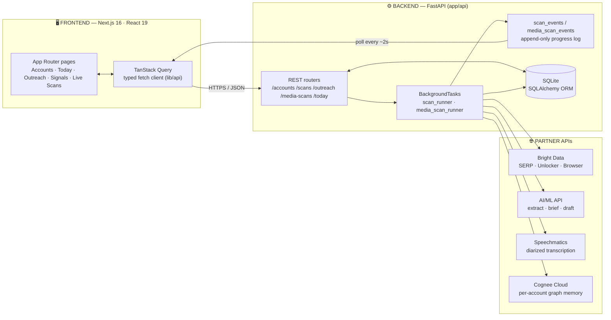
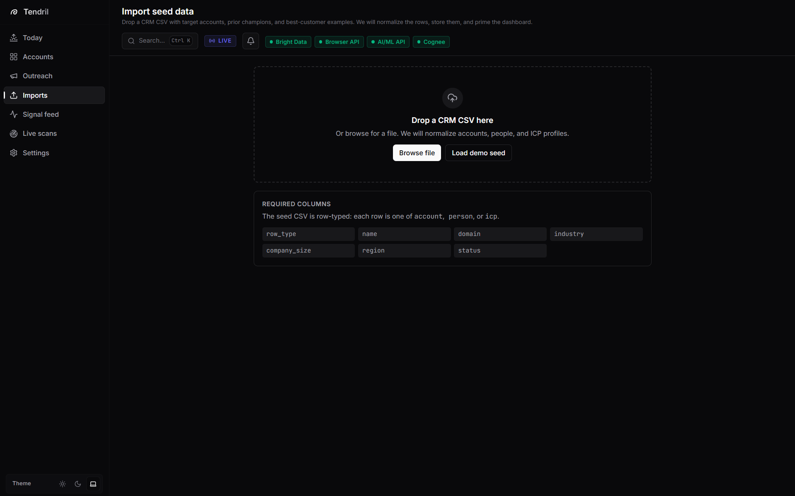
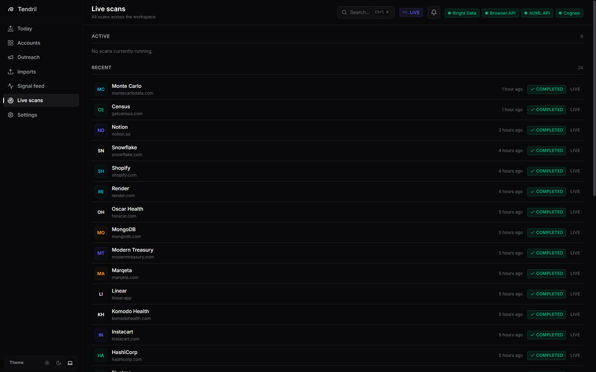
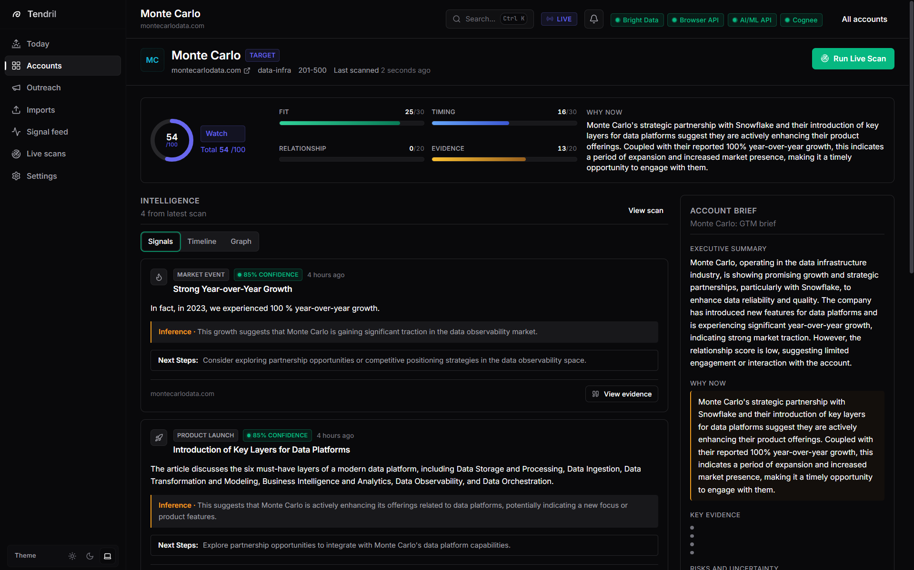
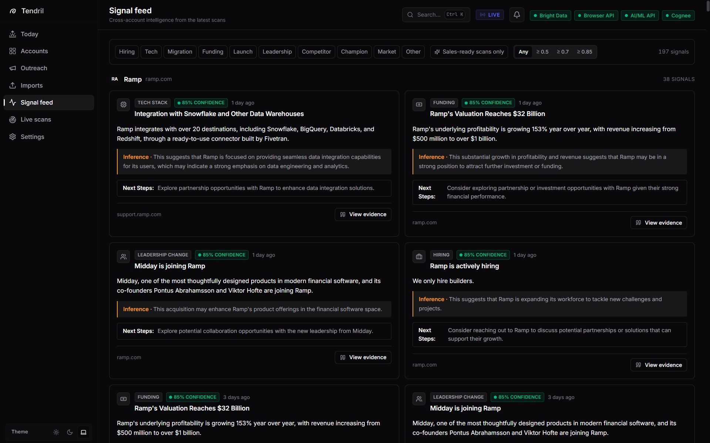
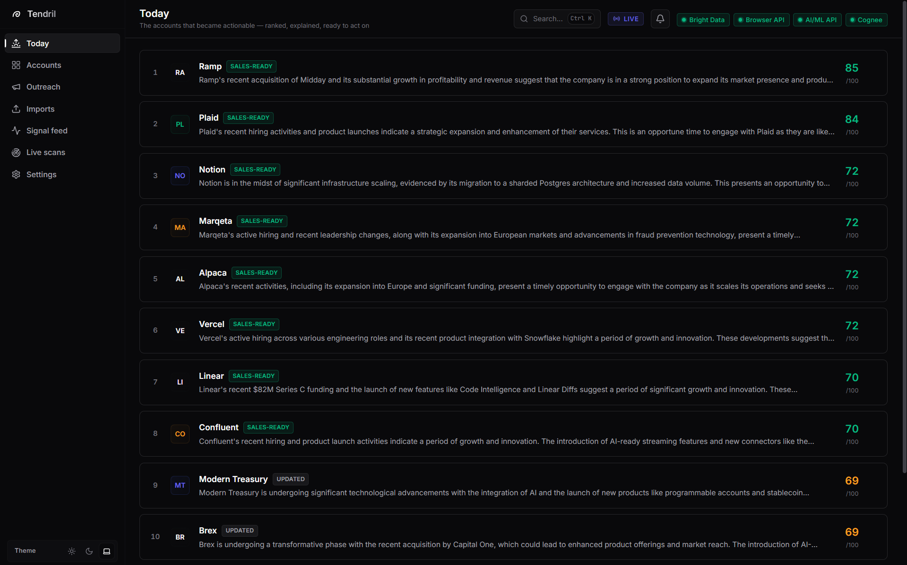
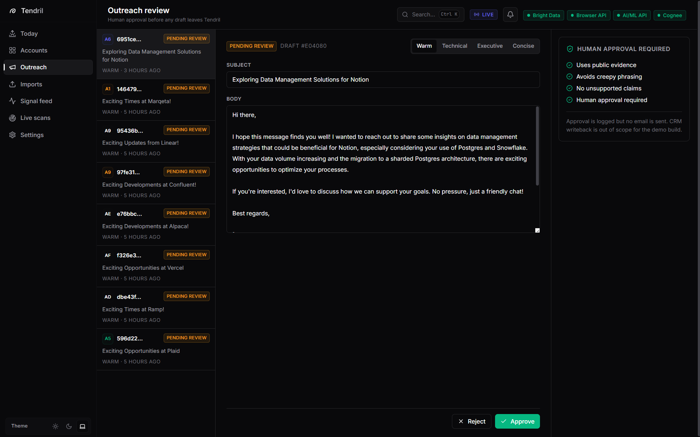

<div align="center">

# 📡 TENDRIL

### Live GTM Intelligence — *who's ready to buy now, why it matters, and what to say next*

<br/>

[](https://brightdata.com)
[]()
[]()

<br/>

**Tendril turns the scattered public web — and the conversations no one writes down — into evidence-backed, scored, ready-to-act GTM signals.**

It scans the live web, *listens* to public talks, remembers every account in a knowledge graph, and hands a sales rep a ranked morning queue: a one-page brief and a tone-controlled outreach draft, every claim tied to a source, nothing ever sent without a human.

<br/>

`Bright Data`  ·  `AI/ML API`  ·  `Cognee`  ·  `Speechmatics`  ·  `FastAPI`  ·  `Next.js 16`  ·  `React 19`

</div>

---

## 🧭 How a request flows: Frontend → Backend → Providers → back

> The single most important diagram in this repo. Tendril is a **Next.js 16 / React 19** dashboard talking to a **FastAPI** backend over a thin, typed REST client. Long-running work (scans) runs as durable background jobs; the UI streams progress by polling an append-only event log. The backend fans out to the partner APIs, persists everything to SQLite, and writes memory to Cognee Cloud.



**The contract in one breath:** the UI never calls a provider directly. It POSTs an intent (`run scan`, `regenerate outreach`), the backend does the heavy, credit-spending work in the background, and the UI re-renders from the persisted event stream and result tables. That separation is why a scan survives a refresh, and why the live panel feels real-time without websockets.

---

## 📖 The journey — from a CSV to a closed-won conversation

Tendril is best understood as a story that happens every morning for a B2B sales rep. Here is that story, screen by screen.

### 1 · It starts with your book of business

No magic input. The rep drops a CRM CSV — target accounts, reference customers, ICP examples, known champions. Tendril normalizes the rows into accounts, people, and an ideal-customer profile, then primes the workspace.

<div align="center">
  
</div>

> **Tech:** `python-multipart` upload → `seed_importer` (idempotent upserts by domain) → SQLAlchemy. The only thing you bring is your list; Tendril brings the intelligence.

---

### 2 · It scans the live web — reliably

For any account, Tendril runs a **live scan**. This is where **Bright Data** does the unglamorous, mission-critical work: finding and *actually retrieving* public evidence from sites that fight back.

| Stage | Bright Data product | What happens |
|------|--------------------|--------------|
| 🔎 **Discover** | **SERP API** | 6–8 targeted queries per account (careers, eng blog, migration, GitHub, press) → ranked candidate URLs |
| 📄 **Scrape** | **Web Unlocker** | fetches bot-protected public pages, returns clean content |
| 🧩 **Fallback** | **Scraping Browser** | renders JavaScript-heavy pages when Unlocker content is thin |

Every fetch and every query is written to an append-only event log, so the **Live Scans** view shows the machinery working in real time — and keeps a full, honest audit trail of provider calls.

<div align="center">
  
</div>

> **Tech:** async `httpx` client with `tenacity` retries · `selectolax` + `BeautifulSoup` SERP parsing · `markdownify` for clean text · graceful per-source failure (one bad page never fails the scan).

---

### 3 · It turns pages into structured signals — with citations

Raw HTML is noise. **AI/ML API** is Tendril's reasoning gateway: an OpenAI-compatible endpoint with **model routing** across three jobs — a cheap model for strict-JSON signal extraction, a stronger model (GPT-4o) for briefs, a fast model for drafts.

Each extracted signal is a small, defensible object: a **type** (hiring / migration / funding / launch / leadership / competitor), a **confidence score**, a plain-English **why it matters**, and a **source URL**. No ungrounded claims.

<div align="center">
  
</div>

> This is the **Account Intelligence Room**. On the left: the live signal cards with confidence and evidence. In the center: the transparent **0–100 score** (Fit · Timing · Relationship · Evidence) that gates whether an account is *sales-ready*. On the right: the auto-generated **account brief** with a memory-grounded "why now".

---

### 4 · It *listens* to the web — the part nobody else does

> *The strongest buying signals are often never written down. They're spoken — in podcasts, earnings calls, conference talks, and interviews.*

This is Tendril's signature move. A parallel **multimodal** pipeline discovers public spoken sources, extracts the real audio (`yt-dlp` + `ffmpeg`), and transcribes it **live with Speechmatics** — speaker diarization, word-level timestamps. A cheap **Featherless** relevance filter gates the expensive extraction so cost stays disciplined, and **content-addressable hashing** (SHA-256 over audio) guarantees the same episode is never transcribed, or paid for, twice.

The payoff: **timestamped, quote-backed buying signals** like a target-account engineer publicly saying *"DBT is tremendous. Snowflake is tremendous."* — evidence that exists nowhere in text.

> **Tech:** `Bright Data SERP` → audio extraction → `Speechmatics` (diarized) → PII scrubbing → `AI/ML API` conversation-signal extraction → durable, resumable stages with per-scan budget caps.

---

### 5 · It remembers — so it reasons over *change*

A normal scraper forgets. Tendril writes every web and spoken signal into **Cognee Cloud**, a hosted knowledge graph scoped per account, and **reads it back** before writing a brief. That closed loop is what lets the "why now" reflect how an account is evolving over weeks — not just what one page said today.

<div align="center">
  
</div>

> The **Signal Feed**: cross-account intelligence accumulating over time, filterable by signal type and confidence. Each card is a memory node — written to Cognee, recallable forever.

> **Tech:** Cognee Cloud REST (`/remember`, `/search` with `GRAPH_COMPLETION`), account-scoped datasets, write-through JSONL mirror, and a graceful local fallback so a demo never breaks.

---

### 6 · It ranks your morning

All of this converges into one screen the rep opens with their coffee: the accounts that *became actionable* — ranked, explained, ready to act on.

<div align="center">
  
</div>

> **Today** answers the only question that matters: of hundreds of accounts, which handful crossed the sales-ready line, and why. Score, delta, and a one-line "why now" — backed by everything above.

---

### 7 · It drafts outreach — but you stay in control

When an account is sales-ready, **AI/ML API** drafts a grounded outreach email. But Tendril treats outreach as a **trust** problem, not a generation problem.

<div align="center">
  
</div>

- 🎚️ **Tone control** — Warm · Technical · Executive · Concise. Toggle it and the email **rewrites live** (with guardrails re-run each time).
- 🛡️ **Ethical guardrails** — no "I saw you…" familiarity, no sensitive attributes, citations required, account-level framing only.
- ✅ **Human-in-the-loop** — every draft is *pending review*. Nothing is ever auto-sent.

> **Tech:** tone-aware prompt routing + deterministic tone presets (works even if the model is down) · `guardrails.check_outreach` on every draft · approve/reject/edit state machine.

---

## 🧰 The full technology map

### Partner integrations (the four pillars)

| Pillar | Technology | Role in Tendril |
|--------|-----------|-----------------|
| 🌐 **Acquire** | **Bright Data** — SERP API · Web Unlocker · Scraping Browser | The live web layer. Discovers and reliably retrieves public evidence at scale. |
| 🧠 **Reason** | **AI/ML API** (OpenAI-compatible) | Model-routed extraction (JSON), briefing (GPT-4o), and outreach drafting. |
| 🕸️ **Remember** | **Cognee Cloud** | Per-account knowledge graph; written to *and* recalled from to ground reasoning over time. |
| 🎙️ **Listen** | **Speechmatics** | Diarized, timestamped transcription of public spoken sources into conversation signals. |
| ⚡ *Optimize* | *Featherless* (supporting) | Cheap relevance gate before expensive extraction. |

### Backend

<p>


</p>

FastAPI · SQLAlchemy ORM (SQLite app state) · durable background scan runners · append-only event logs · `tenacity` retries · `structlog` (secret-redacting) · `markdownify` / `selectolax` parsing · `pytest` suite.

### Frontend

<p>


</p>

Next.js 16 App Router · React 19 · TanStack Query (polling-driven live updates) · Radix primitives · Tailwind v4 · Framer Motion · `@xyflow/react` knowledge-graph view · Recharts · WCAG-AA palette.

---

## 🛡️ Engineered for trust & resilience

Tendril is built like a product, not a script:

- **Evidence-first** — every claim carries a source URL; sales-ready requires ≥2 independent evidence points.
- **Human-in-the-loop** — outreach is never auto-sent; guardrails reject creepy or unsourced copy.
- **Privacy** — transcripts are PII-scrubbed *before* any memory write; sensitive signals are masked.
- **Cost discipline** — Featherless gates expensive calls; content-addressable dedup; per-scan budget caps.
- **It never breaks the demo** — `mock | live | cached` modes and graceful fallbacks (Cognee → local memory, AI/ML → deterministic, Unlocker → Browser).
- **Auditable** — every provider call is a logged, sanitized event.

---

## 🧩 Built with Kiro — spec-driven, not vibe-coded

Tendril was not improvised. It was **specified, planned, and built with [Kiro](https://kiro.dev)** as the engineering driver — and the evidence lives in the repo, not just in this README. The entire `kiro/` folder is the auditable planning trail the product was built from, and the codebase points back to it.

### A real spec → design → implementation loop

Every layer was locked in a Kiro-authored document *before* code was scaffolded:

| Kiro document | What it drove |
|---------------|---------------|
| `kiro-product-blueprint.md` | Product positioning, the three GTM loops, scoring model, partner story |
| `kiro-backend-requirements-checklist.md` | Every backend decision + dependency locked before scaffolding |
| `kiro-backend-implementation-phase-plan.md` | The backend split into the exact phases it was built in |
| `kiro-multimodal-signal-engine-plan.md` | The durable, resumable "it listens" pipeline (CAS dedup, PII, stages) |
| `kiro-frontend-architecture.md` | Screen-by-screen plan, design language, visual direction |
| `kiro-frontend-requirements-checklist.md` | Locked frontend decisions (polling cadence, auto-prime, states) |
| `kiro-external-credentials-usage-guide.md` | How every partner credential is wired into the running system |
| `kiro-deployment-cognee-setup-plan.md` | Demo-safe deployment + Cognee setup |
| `quality-hardening-plan.md` · `gap-fixes.md` · `product-analysis-and-ux-review.md` | Iterative hardening, gap closure, and UX review passes |

### The code traces back to the spec

This is the part that proves it's genuine. Source files end with a comment pointing to the exact Kiro section they were derived from, so any decision is auditable in one hop:

```ts
// frontend/lib/hooks/use-scan.ts
// Decision sourced from kiro/kiro-frontend-requirements-checklist.md F:
//   - refetchInterval 1500ms while non-terminal, stop on completed | failed

// frontend/lib/utils/score.ts
// Discrete thresholds published in kiro/codex-backend-implementation-plan.md
// and kiro/kiro-backend-requirements-checklist.md (sales-ready: total >= 70)

// frontend/lib/copy.ts
// Source: kiro/kiro-frontend-architecture.md §23 + kiro-frontend-assets-plan.md §11
```

### How Kiro shaped the build

- **Phased delivery.** The backend phase plan turned a large surface (scan runner, scoring, briefs, multimodal engine, Cognee memory) into ordered, shippable phases — which is why the pipeline is durable and resumable rather than a monolith.
- **Decisions before code.** Requirements checklists locked choices (dependencies, polling, scoring thresholds, safety rules) up front, so implementation stayed consistent and the 150+ test suite maps cleanly to documented behavior.
- **Single source of truth for tone & safety.** UI copy and guardrail rules were centralized per Kiro specs, making it possible to audit the product's voice and its ethical posture in one pass.
- **An honest audit trail.** Because the planning docs ship next to the code and the code cites them, a reviewer can verify *why* any piece exists — the opposite of a black-box hackathon hack.

> Read `kiro/README.md` for the recommended reading order through the full planning trail.

---

## 🚀 Quick start

**Backend**
```bash
cd backend
uv sync
uv run uvicorn app.main:app --host 0.0.0.0 --port 8000
```

**Frontend**
```bash
cd frontend
pnpm install
pnpm sync:seed
pnpm dev   # http://localhost:3000
```

Configuration is read from the project-root `.env` (see `.env.example`). Keep `SIGNALGRAPH_MOCK_MODE=true` until you're ready to spend live provider credits.

---

## 🗂️ Repository layout

```
backend/   FastAPI service · scan + media runners · extraction · scoring · briefs · outreach
frontend/  Next.js 16 dashboard · TanStack Query client · Radix + Tailwind UI
kiro/      Planning, architecture, requirements, and credential docs
```

---

<div align="center">

### Tendril tells GTM teams **who is ready now, why it matters, and what to say next.**

*The web, unlocked. The signal, extracted. The memory, kept.*

<br/>

**Team TroN** · Built for the Bright Data *Web Data Unlocked* Hackathon

</div>
